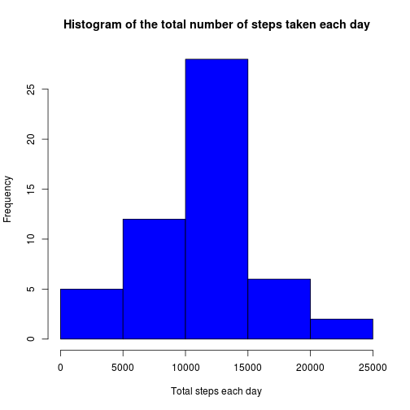
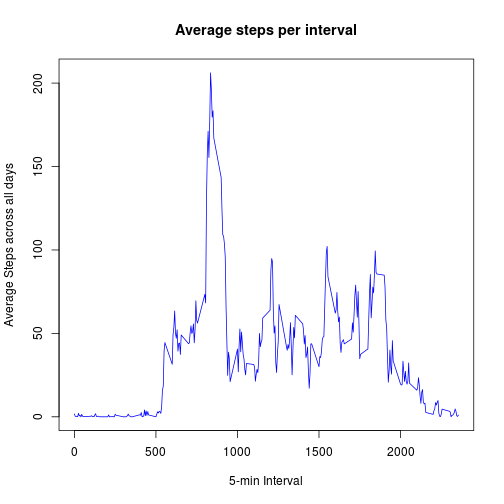
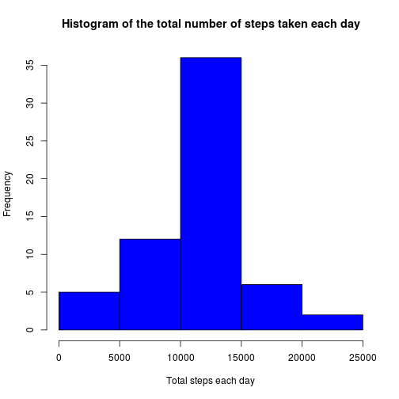
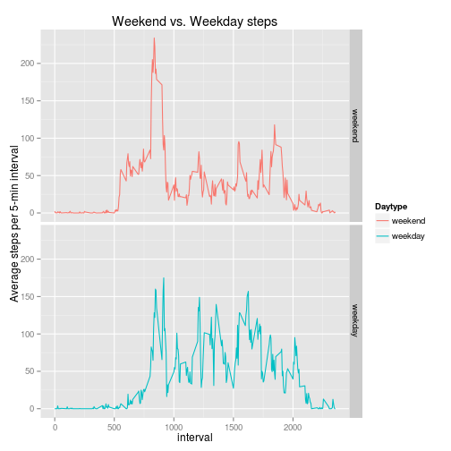

#### Chunhua Cai
This report is my assignment for Reproducible Research: Peer Assessment 1.
This assignment makes use of data from a personal activity monitoring device. This device collects data at 5 minute intervals through out the day. The data consists of two months of data from an anonymous individual collected during the months of October and November, 2012 and include the number of steps taken in 5 minute intervals each day.

## Enviorment set
To avoid the confusion caused by the different locale set, preset the LC_ALL to C.

```r
Sys.setlocale("LC_ALL","C")
```

## Loading and preprocessing the data
In order to be more generic, read the date column by character class and transform to date by **as.Date**. Although in this dataset can be read directly with a **Date** class.


```r
act_data <- read.csv(file = unz('activity.zip','activity.csv'), na.string = "NA",
                    colClass = c('numeric', 'character', 'numeric') )
act_data$date <- as.Date(act_data$date, format = "%Y-%m-%d")
summary(act_data)
```

```
##      steps             date               interval     
##  Min.   :  0.00   Min.   :2012-10-01   Min.   :   0.0  
##  1st Qu.:  0.00   1st Qu.:2012-10-16   1st Qu.: 588.8  
##  Median :  0.00   Median :2012-10-31   Median :1177.5  
##  Mean   : 37.38   Mean   :2012-10-31   Mean   :1177.5  
##  3rd Qu.: 12.00   3rd Qu.:2012-11-15   3rd Qu.:1766.2  
##  Max.   :806.00   Max.   :2012-11-30   Max.   :2355.0  
##  NA's   :2304
```

## What is mean total number of steps taken per day?
For this part of the assignment, you can ignore the missing values in the dataset.
1. Calculate the total number of steps taken per day

2. If you do not understand the difference between a histogram and a barplot, research the difference between them. Make a histogram of the total number of steps taken each day

3. Calculate and report the mean and median of the total number of steps taken per day

###1. Calculate the total number of stpes taken per day

```r
mysum <- function(x) {sum(x, na.rm=TRUE)}
steps_day <- aggregate( steps ~ date, act_data, mysum)
steps_day
```

```
##          date steps
## 1  2012-10-02   126
## 2  2012-10-03 11352
## 3  2012-10-04 12116
## 4  2012-10-05 13294
## 5  2012-10-06 15420
## 6  2012-10-07 11015
## 7  2012-10-09 12811
## 8  2012-10-10  9900
## 9  2012-10-11 10304
## 10 2012-10-12 17382
## 11 2012-10-13 12426
## 12 2012-10-14 15098
## 13 2012-10-15 10139
## 14 2012-10-16 15084
## 15 2012-10-17 13452
## 16 2012-10-18 10056
## 17 2012-10-19 11829
## 18 2012-10-20 10395
## 19 2012-10-21  8821
## 20 2012-10-22 13460
## 21 2012-10-23  8918
## 22 2012-10-24  8355
## 23 2012-10-25  2492
## 24 2012-10-26  6778
## 25 2012-10-27 10119
## 26 2012-10-28 11458
## 27 2012-10-29  5018
## 28 2012-10-30  9819
## 29 2012-10-31 15414
## 30 2012-11-02 10600
## 31 2012-11-03 10571
## 32 2012-11-05 10439
## 33 2012-11-06  8334
## 34 2012-11-07 12883
## 35 2012-11-08  3219
## 36 2012-11-11 12608
## 37 2012-11-12 10765
## 38 2012-11-13  7336
## 39 2012-11-15    41
## 40 2012-11-16  5441
## 41 2012-11-17 14339
## 42 2012-11-18 15110
## 43 2012-11-19  8841
## 44 2012-11-20  4472
## 45 2012-11-21 12787
## 46 2012-11-22 20427
## 47 2012-11-23 21194
## 48 2012-11-24 14478
## 49 2012-11-25 11834
## 50 2012-11-26 11162
## 51 2012-11-27 13646
## 52 2012-11-28 10183
## 53 2012-11-29  7047
```

###2. Histogram of the total number of steps take each day
The below histogram shows the total number of steps take each day. From this histogram will see that most frequent total step area is 10000 to 15000 steps.

```r
hist(steps_day$steps, col="blue", 
    xlab="Total steps each day",
    main="Histogram of the total number of steps taken each day")
```

 

###3. The mean and median of the total number of steps taken per day

```r
steps_day_mean <- mean(steps_day$steps, na.rm=TRUE)
sprintf("the mean of steps per day: %.2f \n", steps_day_mean)
```

```
## [1] "the mean of steps per day: 10766.19 \n"
```

```r
steps_day_median <- median(steps_day$steps, na.rm=TRUE)
sprintf("the median of steps per day: %.2f \n", steps_day_median)
```

```
## [1] "the median of steps per day: 10765.00 \n"
```
The mean is |>**10766.19**<| and the median is |>**10765.00**<|, they are very close.


## What is the average daily activity pattern?
1. Make a time series plot (i.e. type = "l") of the 5-minute interval (x-axis) and the average number of steps taken, averaged across all days (y-axis)

2.  Which 5-minute interval, on average across all the days in the dataset, contains the maximum number of steps?

### 1. Make the daily activity plot


```r
mymean <- function(x) {mean(x,na.rm=TRUE)}
steps_interval <- aggregate( steps ~ interval, act_data, mymean)
plot(steps_interval, type="l", col="blue",
    xlab = "5-min Interval", ylab = "Average Steps across all days",
    main = "Average steps per interval")
```

 

### 2. Max average number of steps

```r
subset(steps_interval,steps_interval$steps == max(steps_interval$steps))
```

```
##     interval    steps
## 104      835 206.1698
```
On average across all days, the interval |>**835**<| contains the maxium number of steps: |>**206.17**<|

## Imputing missing values
Note that there are a number of days/intervals where there are missing values (coded as NA). The presence of missing days may introduce bias into some calculations or summaries of the data.

1. Calculate and report the total number of missing values in the dataset (i.e. the total number of rows with NAs)

2. Devise a strategy for filling in all of the missing values in the dataset. The strategy does not need to be sophisticated. For example, you could use the mean/median for that day, or the mean for that 5-minute interval, etc.

3. Create a new dataset that is equal to the original dataset but with the missing data filled in.

4. Make a histogram of the total number of steps taken each day and Calculate and report the mean and median total number of steps taken per day. Do these values differ from the estimates from the first part of the assignment? What is the impact of imputing missing data on the estimates of the total daily number of steps?

### The missing values in the dataset

```r
summary(act_data)
```

```
##      steps             date               interval     
##  Min.   :  0.00   Min.   :2012-10-01   Min.   :   0.0  
##  1st Qu.:  0.00   1st Qu.:2012-10-16   1st Qu.: 588.8  
##  Median :  0.00   Median :2012-10-31   Median :1177.5  
##  Mean   : 37.38   Mean   :2012-10-31   Mean   :1177.5  
##  3rd Qu.: 12.00   3rd Qu.:2012-11-15   3rd Qu.:1766.2  
##  Max.   :806.00   Max.   :2012-11-30   Max.   :2355.0  
##  NA's   :2304
```

```r
sprintf("there are total |>%d<| missing values",sum(sapply(act_data,is.na)))
```

```
## [1] "there are total |>2304<| missing values"
```
There are |>**2304**<| missing values in the origin dataset.


### Fill the missing data with the mean for 5-minute interval
The strategy for fill missing values: use the mean for 5-minute interval.


```r
nact_data <- act_data
for (i in seq(1,nrow(nact_data))) {
    if (is.na(nact_data$steps[i])) {
        t <- nact_data$interval[i]
	nact_data$steps[i] <- steps_interval[steps_interval$interval==t, 2]
    }
}
summary(nact_data)
```

```
##      steps             date               interval     
##  Min.   :  0.00   Min.   :2012-10-01   Min.   :   0.0  
##  1st Qu.:  0.00   1st Qu.:2012-10-16   1st Qu.: 588.8  
##  Median :  0.00   Median :2012-10-31   Median :1177.5  
##  Mean   : 37.38   Mean   :2012-10-31   Mean   :1177.5  
##  3rd Qu.: 27.00   3rd Qu.:2012-11-15   3rd Qu.:1766.2  
##  Max.   :806.00   Max.   :2012-11-30   Max.   :2355.0
```
From the summary of new data shows that there not NA values.

### Compare between the origin data and fill missing data
Recalculate and plot the histgram, mean and median after imputing missing value.


```r
nsteps_day <- aggregate( steps ~ date, nact_data, sum)
hist(nsteps_day$steps, col="blue",
    xlab="Total steps each day",
    main="Histogram of the total number of steps taken each day")
```

 

```r
nsteps_day_mean <- mean(nsteps_day$steps)
sprintf("the mean of steps per day: %.2f", nsteps_day_mean)
```

```
## [1] "the mean of steps per day: 10766.19"
```

```r
nsteps_day_median <- median(nsteps_day$steps)
sprintf("the median of steps per day: %.2f", nsteps_day_median)
```

```
## [1] "the median of steps per day: 10766.19"
```
* Origin data: the mean is |>**10766.19**<| and the median is |>**10765.00**<|.

* Filld data: the mean is |>**10766.19**<| and the median is |>**10766.19**<|.

From recomputed results, the results do not significantly differ from the analysis for origin data. 

After filled, the mean and median are same.


## Are there differences in activity patterns between weekdays and weekends?
For this part the weekdays() function may be of some help here. Use the dataset with the filled-in missing values for this part.

1. Create a new factor variable in the dataset with two levels <U+2013> <U+201C>weekday<U+201D> and <U+201C>weekend<U+201D> indicating whether a given date is a weekday or weekend day.

2. Make a panel plot containing a time series plot (i.e. type = "l") of the 5-minute interval (x-axis) and the average number of steps taken, averaged across all weekday days or weekend days (y-axis). See the README file in the GitHub repository to see an example of what this plot should look like using simulated data.

### Add new factor to identify the weekend

```r
wkedays <- c('Saturday', 'Sunday')
act_data$Daytype <- factor((weekdays(act_data$date) %in% wkedays),
                        levels=c(FALSE,TRUE), labels=c('weekend','weekday'))
summary(act_data)
```

```
##      steps             date               interval         Daytype     
##  Min.   :  0.00   Min.   :2012-10-01   Min.   :   0.0   weekend:12960  
##  1st Qu.:  0.00   1st Qu.:2012-10-16   1st Qu.: 588.8   weekday: 4608  
##  Median :  0.00   Median :2012-10-31   Median :1177.5                  
##  Mean   : 37.38   Mean   :2012-10-31   Mean   :1177.5                  
##  3rd Qu.: 12.00   3rd Qu.:2012-11-15   3rd Qu.:1766.2                  
##  Max.   :806.00   Max.   :2012-11-30   Max.   :2355.0                  
##  NA's   :2304
```
The summary results show there a new factor column **Datetype** to identify the weekend and weekdays.


### make the plot


```r
mymean <- function(x) {mean(x,na.rm=TRUE)}
steps_wkd_interval <- aggregate( steps ~ Daytype + interval, act_data, mymean)

library(ggplot2)
g <-ggplot(steps_wkd_interval,aes(x=interval,y=steps,Daytype))
g + facet_grid(Daytype~.) + geom_line(aes(color=Daytype)) +
    labs(title="Weekend vs. Weekday steps") +
    labs(y = "Average steps per 5-min interval")
```

 
